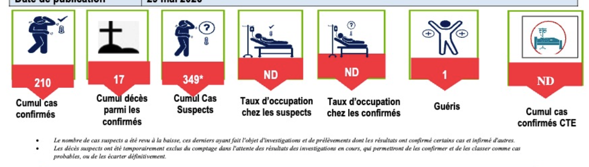
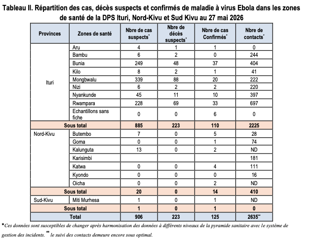

# INSP situation reports (SitRep MVE) — health-zone outbreak indicators

Daily **case, death, contact-tracing, hospitalisation, point-of-entry (PoE), and national cumulative** indicators, extracted from Institut National de Santé Publique (INSP) **Situation Reports** on the 2026 Bundibugyo Ebolavirus (BDBV) outbreak (`SitRep_MVE_*` PDFs in `raw/`).

These data complement WHO weekly external sitreps in `data/epi/` with **INSP-internal reporting** at sitrep date resolution and additional operational fields.

------------------------------------------------------------------------

## Digitisation Protocol

Due to the fast evolving nature of the situation, the sitrep information is continually updated and manually checked, and there are some unavoidable minor discrepancies between healthzone totals, national totals, healthzone info from day to day etc. Below we outline the exact decisions taken in the digitisation process in the interests of transparency.

### Sitrep Structure

Each sitrep consistently features a banner at the top with a description of the situation at a national level. The exact metrics displayed here may vary slightly, but for any national metrics (contained in the "\\\_national" files) we will populate these using this banner in the first instance.

### 

Many sitreps also contain healthzone level breakdowns (e.g. the below table from sitrep 13), and these are sometimes shared directly with INRB from INSP. These are used to calculate healthzone level information, and if a certain metric is not available at the national level, it may be calculated by summing across healthzones. ***Note that disagreements between summed healthzones and nationally reported metrics are not uncommon in these documents.***



### Metric-wise decision protocol

For each metric tracked in the `processed` folder, below is the order of decisions to arrive at the reported figure:

-   `national_cumulative_confirmed_cases`: This is consistently reported in the banner and transcribed as-is.

-   `national_cumulative_confirmed_deaths`: This is consistently reported in the banner and transcribed as-is.

-   `national_cumulative_suspected_cases`: This was consistently reported in the banner as far as sitrep 16 and transcribed as is. From sitrep 16, this was divided into 'Cas suspects en cours d'investigation' (suspected cases under investigation) and 'Cas suspects en isolement' (suspected cases in isolation). We now sum those two categories to continue to give total suspected cases in this file.

-   `national_suspected_cases_under_investigation`: As stated above, this was added in Sitrep 16. We do not yet know how consistently this will be reported but for now we are transcribing it as-is into its own csv file.

-   `national_suspected_cases_in_isolation`: As stated above, this was added in Sitrep 16. We do not yet know how consistently this will be reported but for now we are transcribing it as-is into its own csv file.

-   `national_cumulative_suspected_deaths`: This is not consistently reported in the banner, so we are keeping a running total by adding new suspected deaths (those reported in the banner if available, otherwise the sum of suspected deaths across healthzones) to the previous total

#### Healthzone level files

Healthzone level files track healthzone metrics - after a healthzone reports its first suspected case, it will be tracked in each healthzone level files for that date and all dates thereafter (even if it stops reporting data; in that case the metric will receive ND - No Data).

-   `new_confirmed_cases`: This is often included in a sitrep subtable, and is transcribed as-is.

    -   0's are reported as 0

    -   If a healthzone has a blank tile, says ND, or is not included in the table but is already being tracked, we report ND.

<!-- -->

-   `cumulative_confirmed_cases`: If the metric is included in a sitrep subtable, it is transcribed as-is. If it is not included, the number of `new_confirmed_cases` is added to the previous number of `cumulative_confirmed_cases`.

    -   If `new_confirmed_cases` is 0, blank, says ND, or is not included in the table but is already being tracked, we keep the previous number of `cumulative_confirmed_cases` for that healthzone.

-   `new_suspected_cases:`This is often included in a sitrep subtable, and is transcribed as-is.

    -   0's are reported as 0

    -   If a healthzone has a blank tile, says ND, or is not included in the table but is already being tracked, we report ND.

-   `cumulative_suspected_cases`: This is not usually included in sub-tables. It is calculated by adding the number of `new_suspected_cases` to the previous number of `cumulative_suspected_cases`.

    -   If `new_suspected_cases` is 0, blank, says ND, or is not included in the table but is already being tracked, we keep the previous number of `cumulative_suspected_cases` for that healthzone.

-   `cumulative_suspected_deaths`

-   `cumulative_confirmed_deaths`

-   `new_suspected_deaths` :

### General decision protocol

Health zone level information should match exactly to the latest version of each SitRep (ex. v2 of Report 012). If there is an updated version of a SitRep released, we will update out .csv reports accordingly.

If a new SitRep disagrees with the previously reported values (i.e. reported cases decrease from report to report), we will report values exactly as is, with matching dates to track changes. While health zone level metrics may disagree with national values, we will report the tabular data verbatim.

Occasionally, health zone level data may be sent directly from INSP to INRB. This data may not feature in the SitRep PDFs but will be included in the csv files on this repo.

------------------------------------------------------------------------

## Source documents

**Publisher:** [Institut National de Santé Publique (INSP)](%5Bhttps://insp.cd/%5D(https://insp.cd/category/actualites/)), Democratic Republic of the Congo.

**Series:** SitRep **MVE** (maladie à virus Ebola), 2026.

**Committed PDFs (`raw/`):**

| File                      | Report |
|---------------------------|--------|
| `SitRep_MVE_001-2026.pdf` | 001    |
| `SitRep_MVE_002-2026.pdf` | 002    |
| `SitRep_MVE_004-2026.pdf` | 004    |
| `SitRep_MVE_005-2026.pdf` | 005    |
| `SitRep_MVE_006-2026.pdf` | 006    |
| `SitRep_MVE_007-2026.pdf` | 007    |
| `SitRep_MVE_008-2026.pdf` | 008    |
| `SitRep_MVE_009-2026.pdf` | 009    |
| `SitRep_MVE_010-2026.pdf` | 010    |
| `SitRep_MVE_011-2026.pdf` | 011    |
| `SitRep_MVE_012_2026.pdf` | 012    |
| `SitRep_MVE_013_2026.pdf` | 013    |

**Not in repo:** `SitRep_MVE_003-2026.pdf` (gap between 002 and 004).

**Extraction:** Values are **manually transcribed** from PDF tables. There is no PDF parser in this folder.

| Folder | Source | Grain | Role |
|------------------|------------------|------------------|------------------|
| `data/epi/` | WHO Weekly External Situation Report | Weekly | Official external case/death tables |
| `data/insp_sitrep/` | INSP SitRep MVE PDFs | Daily (per report date) | INSP operational and national summary metrics |

------------------------------------------------------------------------

## Repository layout

| Path | Description |
|------------------------------------|------------------------------------|
| `raw/SitRep_MVE_*.pdf` | Source sitreps (Git LFS) |
| `processed/insp_sitrep__*__daily.csv` | **28** contract tables (listed below) |
| `process.R` | Map `nom` to canonical shapefile names |
| `metadata.yaml` | Provenance and licence |

| Layer | Zones | Date range in CSVs |
|------------------------|------------------------|------------------------|
| Outbreak-zone metrics | **21** canonical `nom` values (see list below) | Mostly **2026-05-14** – **2026-05-24** (ISO); hospitalisation and PoE from **2026-05-20**; PoE through **2026-05-23** |
| National `national_*` metrics | **`nom` = `DRC`**, one row per date | **2026-05-14** – **2026-05-28** (ISO) |

PDFs **011** and **012** are in `raw/`; zone-level processed tables may not yet include rows from those reports until they are transcribed.

**Outbreak-affected zones in processed data:** Adi, Aru, Bambu, Bunia, Butembo, Goma, Kalunguta, Karisimbi, Katwa, Kilo, Komanda, Kyondo, Mahagi, Mangala, Miti-Murhesa, Mongbalu, Nizi, Nyakunde, Oicha, Rwampara, Tchomia.

------------------------------------------------------------------------

## Filename contract

``` text
insp_sitrep__<metric>__daily.csv
```

Grammar: `tools/lib/schema.py`. Each file is a long-format vector: **`nom`**, **`date`**, plus one metric column.

------------------------------------------------------------------------

## Processed outputs (28 files)

### Case, death, and contact tracing

| File | Value column | Notes |
|------------------------|------------------------|------------------------|
| `insp_sitrep__new_suspected_cases__daily.csv` | `new_suspected_cases` |  |
| `insp_sitrep__cumulative_suspected_cases__daily.csv` | `cumulative_suspected_cases` |  |
| `insp_sitrep__new_confirmed_cases__daily.csv` | `new_confirmed_cases` |  |
| `insp_sitrep__cumulative_confirmed_cases__daily.csv` | `cumulative_confirmed_cases` |  |
| `insp_sitrep__new_suspected_deaths__daily.csv` | `new_suspected_deaths` |  |
| `insp_sitrep__cumulative_suspected_deaths__daily.csv` | `cumulative_suspected_deaths` |  |
| `insp_sitrep__cumulative_confirmed_deaths__daily.csv` | `cumulative_confirmed_deaths` | No separate `new_confirmed_deaths` file |
| `insp_sitrep__new_contacts_listed__daily.csv` | `new_contacts_listed` |  |
| `insp_sitrep__cumulative_contacts_traced__daily.csv` | `cumulative_contacts_traced` |  |
| `insp_sitrep__new_contacts_isolated__daily.csv` | `new_contacts_isolated` |  |
| `insp_sitrep__cumulative_contacts_isolated__daily.csv` | `cumulative_contacts_isolated` |  |
| `insp_sitrep__contacts_seen__daily.csv` | `contacts_seen` |  |

### National cumulative totals (`nom` = `DRC`)

Republic-wide figures from the sitrep summary banner. **One row per report date** with `nom` = **`DRC`**:

| File | Value column | Notes |
|------------------------|------------------------|------------------------|
| `insp_sitrep__national_cumulative_suspected_cases__daily.csv` | `national_cumulative_suspected_cases` |  |
| `insp_sitrep__national_cumulative_confirmed_cases__daily.csv` | `national_cumulative_confirmed_cases` |  |
| `insp_sitrep__national_cumulative_suspected_deaths__daily.csv` | `national_cumulative_suspected_deaths` |  |
| `insp_sitrep__national_cumulative_confirmed_deaths__daily.csv` | `national_cumulative_confirmed_deaths` |  |

`tools.build_geojson` applies the **latest** `DRC` row for each metric to **all** health-zone features (same map behaviour as before, without 519 duplicate CSV rows).

### Hospitalisation (from 2026-05-20 in current data)

| File | Value column | Notes |
|------------------------|------------------------|------------------------|
| `insp_sitrep__hospitalised__daily.csv` | `hospitalised` |  |
| `insp_sitrep__in_bed_previous_day__daily.csv` | `in_bed_previous_day` |  |
| `insp_sitrep__new_hosp_admissions__daily.csv` | `new_all_admissions` | Metric token in filename is `new_hosp_admissions` |
| `insp_sitrep__new_hosp_detainees__daily.csv` | `new_hosp_detainees` |  |
| `insp_sitrep__new_hosp_other__daily.csv` | `new_other` |  |
| `insp_sitrep__hosp_escaped__daily.csv` | `escaped` |  |

### Points of entry (zone totals; 2026-05-20 – 2026-05-23)

| File | Value column |
|------------------------------------|------------------------------------|
| `insp_sitrep__total_poe_screened__daily.csv` | `total_poe_screened` |
| `insp_sitrep__total_poe_passed__daily.csv` | `total_poe_passed` |
| `insp_sitrep__total_poe_sanitised__daily.csv` | `total_poe_sanitised` |
| `insp_sitrep__total_poe_hand_washing__daily.csv` | `total_poe_hand_washing` |
| `insp_sitrep__total_poe_refused_screening__daily.csv` | `total_poe_refused_screening` |
| `insp_sitrep__total_poe_refused_hand_washing__daily.csv` | `total_poe_refused_hand_washing` |

Per-site PoE breakdown in the PDFs is not exported.

------------------------------------------------------------------------

## CSV contract

| Column | Description |
|------------------------------------|------------------------------------|
| `nom` | Canonical health-zone name after `process.R`, or **`Sans Fiche`** / **`NA`** for non-zone roll-ups (kept in CSV, omitted from GeoJSON) |
| `date` | Sitrep **report date** (ISO `YYYY-MM-DD`) |
| `<metric>` | Count, or **`ND`** if not reported in that sitrep |

**Special `nom` values:**

| `nom` | In CSV | In GeoJSON |
|-------------------|----------------------|-------------------------------|
| `Sans Fiche`, `NA` | Yes | No (omitted from map) |
| `DRC` | Yes (`national_*` files only) | Yes (broadcast to every zone) |

**Uniqueness:** one row per (`nom`, `date`) per file.

**Missing values:** treat `ND` as missing in analysis (`na.strings = "ND"` in R).

**Example (R):**

``` r
library(here)

cases <- read.csv(
  here("data/insp_sitrep/processed/insp_sitrep__cumulative_confirmed_cases__daily.csv"),
  na.strings = "ND"
)
cases[cases$date == "2026-05-24", c("nom", "cumulative_confirmed_cases")]
```

------------------------------------------------------------------------

## Workflow

### 1. Manual extraction

1.  Add `SitRep_MVE_###-2026.pdf` under `raw/` (use hyphen before `2026`; `012` is currently `SitRep_MVE_012_2026.pdf`).
2.  Append rows to the relevant `processed/*.csv` files using PDF zone labels in `nom`.
3.  Use **ISO dates** where possible.

### 2. Name normalisation (`process.R`)

From repo root:

``` bash
Rscript data/insp_sitrep/process.R
```

Maps PDF spellings via `data/aliases.csv` (e.g. `Mongbwalu` → `Mongbalu`, `Nyankunde` → `Nyakunde`, `Karissibi` → `Karisimbi`). Stops on unresolved names or duplicate (`nom`, `date`) keys.

### 3. QA and GeoJSON build

``` bash
python -m tools.qa insp_sitrep
python -m tools.build_geojson   # if vectors pass QA
```

------------------------------------------------------------------------

## Data quality and limitations

| Issue | Detail |
|------------------------------------|------------------------------------|
| Manual transcription | Verify against source PDFs before release. |
| Partial zone coverage | Only reported outbreak zones appear in zone-level files; missing zone ≠ zero. |
| `ND` cells | Metric not published for that zone/date. |
| Missing sitrep 003 | Gap between reports 002 and 004. |
| PDF vs processed lag | `raw/` includes 011–012; zone tables may end earlier until transcribed. |
| National files | Use `nom` = `DRC` only; do not duplicate republic totals across zone rows in CSV. |
| Hospitalisation column names | e.g. `new_all_admissions`, `new_other`, `escaped` differ from filename tokens. |
| No PDF automation | `process.R` only normalises `nom`. |

------------------------------------------------------------------------

## Provenance

-   **Reports:** `raw/SitRep_MVE_*.pdf`
-   **Geometry:** `data/shapefiles/DRC_Health_zones.shp`
-   **Aliases:** `data/aliases.csv`
-   **Metadata:** `metadata.yaml`
-   **INSP contact:** [pierre.akilimali\@insp.cd](mailto:pierre.akilimali@insp.cd)

See `data/README.md` for project-wide conventions.
